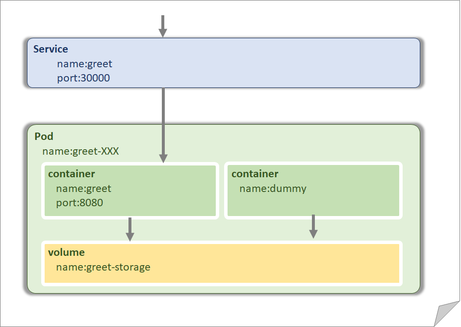

# ApplicationDeployment
Kubernetesにアプリケーションをデプロイしてみましょう。

そして、
 - Podとはどんなもの？
 - ReplicaSet (Deployments,StatefulSets)は何をしてくれる？
を学んでいきたいと思います。

今回は、下記のようなアプリケーションを動かします。

# 事前準備

Kubernetesを使える環境を用意してください。

## 環境毎の事前準備

お好きな環境を使ってください。
登壇者は、EKS、AKSはあまり詳しくありません。GKEを使っています。

**[Google Kubernetes Engine](https://cloud.google.com/kubernetes-engine/)** 
 事前準備は[prepared-gke.md](./prepared-gke.md)。
 
 
**[Amazon EKS](https://aws.amazon.com/jp/eks/)** 
 事前準備は[prepared-eks.md](./prepared-eks.md)。
 
 
**[Azure Kubernetes Service](https://azure.microsoft.com/ja-jp/services/kubernetes-service/)** 
事前準備は[prepared-aks.md](./prepared-aks.md)。
 
 
**[Docker for Windows](https://docs.docker.com/docker-for-windows/)** 
事前準備は[prepared-win.md](./prepared-win.md)。
 
 
**[Docker for Mac](https://docs.docker.com/docker-for-mac/)** 
事前準備は[prepared-mac.md](./prepared-mac.md) 

# ハンズオン

ハンズ資料は、

- [https://speakerdeck.com/hirokimatsumoto/kubernetes-hands-on-apps-for-k8ssa](https://speakerdeck.com/hirokimatsumoto/kubernetes-hands-on-apps-for-k8ssa)

となります。当日公開予定となっております。
