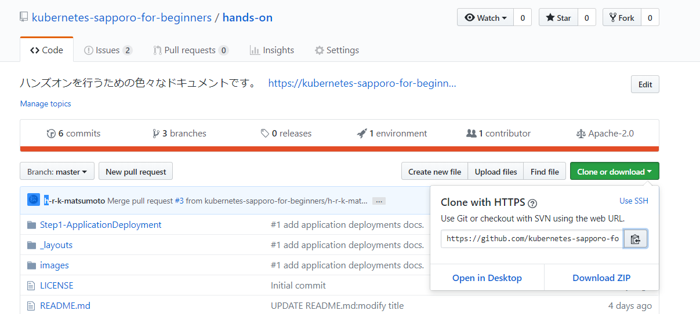

# Docker for Mac 事前準備

## Kubernetesの有効化

Kuberntesの設定画面で、 `Enable Kubernetes` に、チェックを付けてください。

そして、Kubernetesを選択してください。


**公式サイトの設定ドキュメント**<br>
https://docs.docker.com/docker-for-windows/#kubernetes

公式ドキュメントにある、 `kubectl` コマンドが利用できることを確認してください。

## ハンズオンのための事前準備

### ハンズオン資料のClone
まず、本リポジトリをcloneしてください。gitコマンドが使えない場合は、下記画面のようにzipでダウンロード、展開を行って下さい。



### StorageClassの作成

下記コマンドを行い、`standard` のStorageClassを作成してください。

```
$ cd hands-on/Step1-ApplicationDeployment/kubernetes-prepared
$ kubectl apply -f docker-storageclass.yaml
storageclass.storage.k8s.io "standard" created

$ kubectl get storageclass
NAME                 PROVISIONER          AGE
hostpath (default)   docker.io/hostpath   62d
standard (default)   docker.io/hostpath   58s
$
```

正常に作成されると、 `kubectl get storageclass` で、 `standard` が表示されます。
